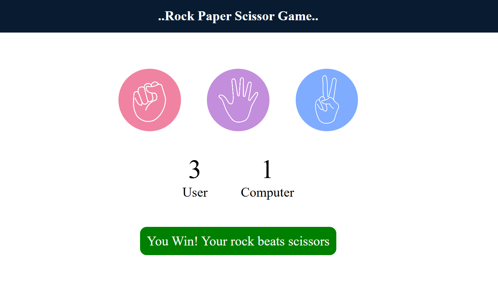

Here’s a well-structured **README.md** for a **Rock Paper Scissors game** built with **HTML, CSS, and JavaScript**. You can customize the details to match your own implementation or GitHub repo.

---

# 🪨📄✂️ Rock Paper Scissors Game

A simple and interactive **Rock Paper Scissors** game built using **HTML**, **CSS**, and **JavaScript**. Challenge the computer and test your luck!

## 🎮 Demo

> [Live Demo](https://ajayyadav0001.github.io/RockPaperScissorsGame../) 
(Swap this link with your deployed site, e.g., GitHub Pages or Netlify)

---

## 📸 Preview

  


---

## ⚙️ Features

- 🎲 Play against a computer
- 🧠 Computer generates random choices
- 📊 Score tracking
- ✨ Responsive design
- 🔁 Replayable rounds

---

## 🛠️ Built With

- **HTML** – Structure of the game
- **CSS** – Styling and layout
- **JavaScript** – Game logic and interactivity

---

## 🚀 Getting Started

To run the project locally:

```bash
git clone https://github.com/yourusername/rock-paper-scissors.git
cd rock-paper-scissors
open index.html
```

Or simply open `index.html` in your browser.

---

## 📂 File Structure

```
rock-paper-scissors/
│
├── index.html      # Main HTML file
├── style.css       # CSS styles
└── script.js       # Game logic
```

---

## 🧠 Game Logic

- Player selects Rock, Paper, or Scissors.
- Computer randomly picks a choice.
- Game compares the two and declares the winner.
- Score is updated accordingly.

---

## 💡 Future Enhancements

- Add sound effects
- Add animation transitions
- Include difficulty levels
- Multiplayer mode (local)

---

## 🙌 Acknowledgements

- JavaScript DOM manipulation concepts
- Inspiration from classic childhood games

---

